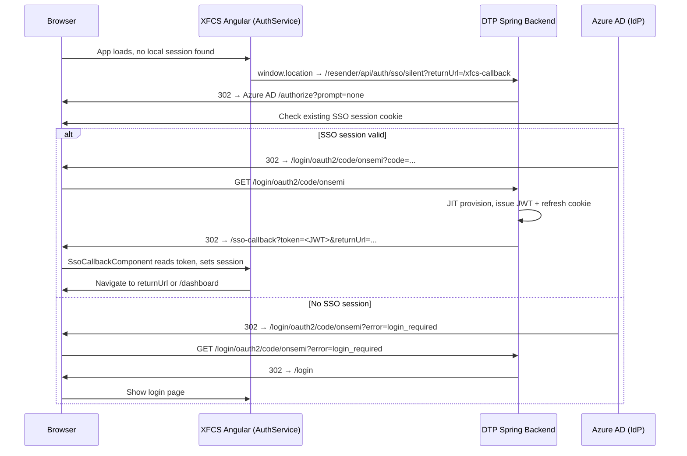
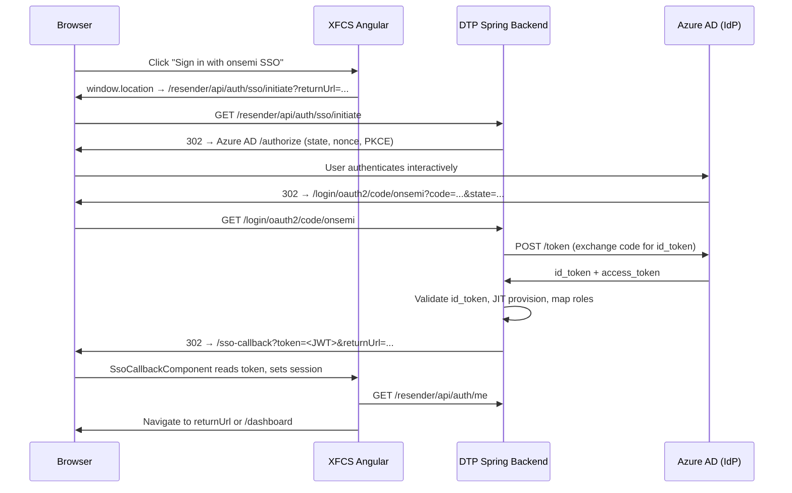

# Design Document: onsemi SSO Login — XFCS Reloader

## Overview

This design adds OIDC-based Single Sign-On (SSO) for onsemi corporate users (Azure AD / Entra ID) to the XFCS Reloader application. The key architectural constraint is that **XFCS Reloader does not issue tokens** — the DTP Resender backend is the sole token issuer and the sole OIDC relying party. XFCS Reloader's frontend delegates all auth operations to DTP's `/resender/api/auth/*` endpoints, and the XFCS backend only validates JWTs issued by DTP.

This means the SSO implementation is split:
- **DTP Resender backend** — owns the OIDC client registration, the IdP callback, JIT provisioning, role mapping, and JWT issuance. These changes are defined in the DTP SSO spec and are shared.
- **XFCS frontend** — adds the SSO button, the `/sso-callback` route, silent SSO initiation, and the `handleSsoCallback` method to `AuthService`. All of these call DTP endpoints.
- **XFCS backend** — no changes required. It already validates DTP-issued JWTs via `JwtAuthenticationFilter`. SSO-issued JWTs are structurally identical to local-login JWTs.

The protocol is **OIDC Authorization Code flow with PKCE** via Azure AD / Entra ID, handled entirely by Spring Security on the DTP backend.

### Silent / Automatic SSO

When the XFCS app loads and finds no local session, `AuthService` calls `GET /resender/api/auth/sso/silent` (a DTP endpoint). DTP redirects to Azure AD with `prompt=none`. If an Azure AD session cookie exists, the user is silently authenticated and DTP redirects back to the XFCS `/sso-callback` route with a JWT. If no Azure AD session exists, DTP redirects to the XFCS `/login` page.



---

## Architecture

### Interactive SSO flow (user clicks the SSO button)



---

## Components and Interfaces

### DTP Backend (shared — changes defined in DTP SSO spec)

The DTP backend owns all OIDC integration. The XFCS-specific concern is that the DTP `SsoAuthenticationSuccessHandler` must redirect to the **XFCS frontend** `/sso-callback` route (not the DTP frontend) when the SSO flow was initiated from XFCS. This is handled by passing a `returnUrl` that starts with `/xfcs-callback` or by a configurable `post-login-redirect-uri` per application.

The DTP backend components relevant to XFCS:
- `SsoController` — exposes `/resender/api/auth/sso/initiate` and `/resender/api/auth/sso/silent`
- `SsoAuthenticationSuccessHandler` — issues JWT, sets refresh cookie, redirects to `returnUrl`
- `SsoUserProvisioningService` — JIT provisioning in shared schema
- `AuthConfigController` — exposes `GET /resender/api/auth/config` returning `{ ssoEnabled: boolean }`

### XFCS Frontend (new/modified)

#### 1. `SsoCallbackComponent` (new — `auth/sso-callback.component.ts`)
A minimal route component at `/sso-callback`:
- Reads `token` query param from the URL.
- Reads `returnUrl` query param (defaults to `/dashboard`).
- Calls `AuthService.handleSsoCallback(token)`.
- On success: navigates to `returnUrl` (validated as relative path).
- On error: navigates to `/login?reason=sso-error`.

#### 2. `AuthService` (modified — `auth/auth.service.ts`)
Add two methods:

`handleSsoCallback(token: string): Observable<void>`
- Calls `setSession(token)` to store the JWT and schedule refresh.
- Calls `loadMe()` to populate `currentUser` signal.
- Returns the observable so `SsoCallbackComponent` can navigate on completion.

`trySilentSso(returnUrl: string): void`
- Only called when `ssoEnabled` is `true` (from `/resender/api/auth/config`) and no local session exists.
- Sets a 5-second timeout; if not resolved, navigates to `/login`.
- Performs `window.location.href = '/resender/api/auth/sso/silent?returnUrl=' + encodeURIComponent(returnUrl)`.

Add `ssoEnabled` signal (default `false`):
- Populated on app init by calling `GET /resender/api/auth/config`.
- Used by `LoginComponent` to conditionally show the SSO button.
- Used by the app initializer to decide whether to attempt silent SSO.

#### 3. `LoginComponent` (modified — `auth/login.component.ts`)
- Add "Sign in with onsemi SSO" button, visible only when `authService.ssoEnabled()` is `true`.
- On click: set `loading = true`, then `window.location.href = '/resender/api/auth/sso/initiate?returnUrl=' + encodeURIComponent(returnUrl)`.
- Button shows a spinner while the redirect is in progress (loading state is set and never cleared — the page navigates away).
- If `reason=sso-error` is present in query params, display an error message above the form.

#### 4. `AppInitializer` (modified — `app.config.ts` or a new `APP_INITIALIZER` factory)
- On app startup, call `GET /resender/api/auth/config` to populate `ssoEnabled`.
- If `ssoEnabled` is `true` and no local session exists, call `authService.trySilentSso(currentUrl)`.

#### 5. `app.routes.ts` (modified)
- Add route: `{ path: 'sso-callback', component: SsoCallbackComponent }` (no auth guard — this is the landing point after SSO).

### XFCS Backend

No changes required. The `JwtAuthenticationFilter` already validates DTP-issued JWTs. SSO-authenticated users receive structurally identical JWTs (same `sub`, `roles`, `exp` claims), so no backend modification is needed.

---

## Data Models

### No schema changes
SSO users are provisioned into the shared `app_users` table by the DTP backend. The XFCS backend reads from the same schema and the existing `AppUser` entity is compatible.

### Environment config additions (XFCS frontend)
```typescript
// environment.ts / environment.prod.ts
export const environment = {
  production: false,
  apiUrl: '/xfcs-reloader/api',
  authUrl: '/resender/api/auth',
  featureFlags: {
    xfcsReloaderEnabled: true,
    ssoEnabled: false  // runtime override via /resender/api/auth/config
  }
};
```

The `ssoEnabled` flag in environment is a local default only. The authoritative value comes from `GET /resender/api/auth/config` at runtime, so SSO can be toggled without a frontend rebuild.

---

## Correctness Properties

A property is a characteristic or behavior that should hold true across all valid executions of a system — essentially, a formal statement about what the system should do. Properties serve as the bridge between human-readable specifications and machine-verifiable correctness guarantees.

Property 1: SSO callback token round-trip
*For any* valid JWT token string passed to `AuthService.handleSsoCallback(token)`, the token should be stored in session storage and `getToken()` should return the same value, and `currentUser` should be populated after `loadMe()` resolves.
**Validates: Requirements 2.2, 5.4**

Property 2: Silent SSO fallback on timeout
*For any* silent SSO attempt that does not complete within 5 seconds, the system should navigate to `/login` rather than leaving the user on a blank page.
**Validates: Requirements 6.4**

Property 3: Open redirect prevention in SSO callback
*For any* `returnUrl` value read from the query string in `SsoCallbackComponent`, the component should only navigate to paths that start with `/` and do not contain `://`, rejecting all others by falling back to `/dashboard`.
**Validates: Requirements 8.6**

Property 4: SSO button visibility matches config
*For any* value of `ssoEnabled` returned by `/resender/api/auth/config`, the SSO button in `LoginComponent` should be visible if and only if `ssoEnabled` is `true`.
**Validates: Requirements 7.3**

Property 5: Session state equivalence after SSO vs local login
*For any* JWT token (whether issued via SSO or local login), after calling `setSession(token)`, the `isAuthenticated()` method should return `true` and `getToken()` should return the same token.
**Validates: Requirements 5.4**

---

## Error Handling

| Scenario | DTP Backend behavior | XFCS Frontend behavior |
|---|---|---|
| IdP unreachable at initiation | DTP redirects to `/login?reason=sso-error` | `LoginComponent` reads `reason` param and shows "SSO unavailable, use local login" |
| Invalid/expired OIDC assertion | DTP redirects to `/login?reason=sso-error` | Same as above |
| JIT provisioning DB failure | DTP redirects to `/login?reason=sso-error` | Same as above |
| SSO disabled via config | `GET /resender/api/auth/config` returns `ssoEnabled: false` | SSO button hidden; silent SSO skipped |
| Invalid returnUrl in callback | `SsoCallbackComponent` sanitizes to `/dashboard` | User lands on dashboard |
| Silent SSO timeout (5s) | N/A | `trySilentSso` cancels and navigates to `/login` |
| `sso-callback` route with no token | `SsoCallbackComponent` detects missing token | Navigates to `/login?reason=sso-error` |

---

## Testing Strategy

### Unit tests (Angular — Jasmine/Karma)
- `SsoCallbackComponent`: verify token is read from query params, `handleSsoCallback` is called, navigation occurs on success and on error.
- `AuthService.handleSsoCallback`: verify `setSession` is called with the token, `loadMe` is called, `currentUser` is populated.
- `AuthService.trySilentSso`: verify `window.location.href` is set to the correct DTP URL, and that the 5-second timeout guard navigates to `/login`.
- `LoginComponent`: verify SSO button is shown when `ssoEnabled = true`, hidden when `false`, and that clicking it sets `loading = true` and redirects to the DTP initiate URL.

### Property-based tests (using [fast-check](https://fast-check.io/) — TypeScript PBT library)

Each property test runs a minimum of 100 iterations with randomly generated inputs.

Property 1 test — `SsoCallbackTokenRoundTripTest`:
- Generate random JWT-shaped strings (header.payload.signature).
- Call `handleSsoCallback(token)`, assert `getToken()` returns the same value.
- Tag: `Feature: onsemi-sso-login, Property 1: SSO callback token round-trip`

Property 3 test — `ReturnUrlSanitizationTest`:
- Generate arbitrary strings as `returnUrl`.
- Assert that only strings starting with `/` and not containing `://` pass through; all others map to `/dashboard`.
- Tag: `Feature: onsemi-sso-login, Property 3: Open redirect prevention in SSO callback`

Property 4 test — `SsoButtonVisibilityTest`:
- Generate random boolean values for `ssoEnabled`.
- Assert SSO button DOM presence matches the `ssoEnabled` value.
- Tag: `Feature: onsemi-sso-login, Property 4: SSO button visibility matches config`

Property 5 test — `SessionEquivalenceTest`:
- Generate random JWT-shaped strings.
- Call `setSession(token)`, assert `isAuthenticated()` is `true` and `getToken()` returns the same token.
- Tag: `Feature: onsemi-sso-login, Property 5: Session state equivalence after SSO vs local login`
