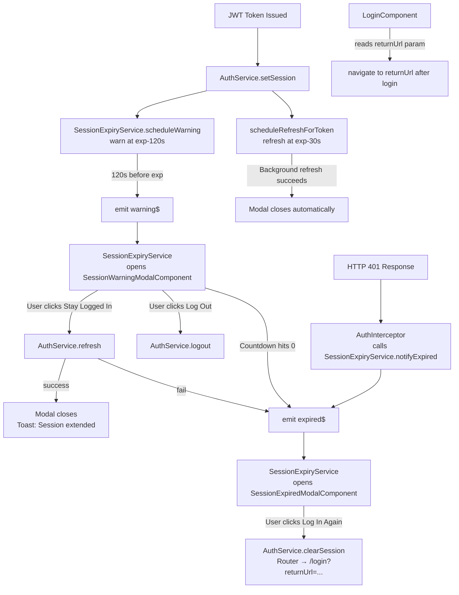

# Design Document: Session Expiry UX

## Overview

The current session expiry handling in `xfcs-reloader-fullstack` is a silent hard-redirect: a 401 response triggers `auth.logout()` in the interceptor, which clears state and navigates to `/login` with no user feedback. This is disorienting and causes users to lose unsaved work.

This design introduces an industry-standard two-phase session expiry UX:

1. **Warning phase** — a modal shown ~2 minutes before the token expires, with a live countdown and a "Stay Logged In" button.
2. **Expired phase** — a modal shown when the session has fully expired (via 401 or countdown reaching zero), with a "Log In Again" button that preserves the user's current URL.

Because `xfcs-reloader-fullstack` does not yet have a `GlassDialogService`, this feature also introduces a lightweight one consistent with the `dtp-resender-fullstack` implementation. Both modals integrate with the existing glassmorphism design system (`glass-panel`, `ToastService`).

---

## Architecture



---

## Components and Interfaces

### GlassDialogService (new)

A lightweight programmatic dialog service. Renders a component into a full-screen overlay using Angular's `ApplicationRef` and `createComponent`.

```typescript
export interface GlassDialogConfig {
  data?: unknown;
  disableClose?: boolean;
}

export interface GlassDialogRef {
  close(result?: unknown): void;
  afterClosed(): Observable<unknown>;
}

@Injectable({ providedIn: 'root' })
export class GlassDialogService {
  open<T>(component: Type<T>, config?: GlassDialogConfig): GlassDialogRef;
}
```

**Implementation notes:**
- Uses `createComponent` + `ApplicationRef.attachView` to render into `document.body`
- Wraps the component in a `.glass-dialog-overlay` div (full-screen backdrop)
- If `disableClose: false` (default), clicking the backdrop calls `ref.close()`
- Listens for `Escape` keydown only when `disableClose: false`
- Injects dialog data via `GLASS_DIALOG_DATA` injection token

---

### SessionExpiryService (new)

Central coordinator for all session expiry logic. Decouples the interceptor and auth service from UI concerns.

```typescript
@Injectable({ providedIn: 'root' })
export class SessionExpiryService {
  // Emits seconds remaining when warning threshold is crossed
  readonly warning$: Observable<number>;
  // Emits void when session is confirmed expired
  readonly expired$: Observable<void>;

  scheduleWarning(token: string): void;   // called by AuthService.setSession
  cancelWarning(): void;                  // called by AuthService.setSession(null)
  notifyExpired(): void;                  // called by AuthInterceptor on 401
}
```

**Responsibilities:**
- Parse JWT expiry from token
- Schedule a `timer()` to fire at `exp - 120s` (warning threshold)
- Emit `warning$` with seconds remaining
- Emit `expired$` when `notifyExpired()` is called or countdown hits zero
- Track modal open state to prevent duplicates (singleton guard)
- Open `SessionWarningModalComponent` or `SessionExpiredModalComponent` via `GlassDialogService`

---

### SessionWarningModalComponent (new)

```
┌─────────────────────────────────────────────────┐
│  ⚠  Session Expiring Soon                        │
│                                                   │
│  Your session will expire in                      │
│                                                   │
│           01:47                                   │
│        (countdown)                                │
│                                                   │
│  Stay active to keep working, or log out now.    │
│                                                   │
│  [ Log Out ]          [ Stay Logged In ]          │
└─────────────────────────────────────────────────┘
```

- Receives `secondsRemaining: number` as input via `GLASS_DIALOG_DATA`
- Runs a `setInterval` every 1000ms to decrement the counter
- Formats remaining time as `MM:SS`
- On "Stay Logged In": calls `AuthService.refresh()`, closes modal on success, shows toast
- On "Log Out": calls `AuthService.logout()`
- On countdown = 0: closes self, `SessionExpiryService` opens `SessionExpiredModalComponent`
- Listens to `AuthService.token$` — if a new token arrives (background refresh), closes automatically

---

### SessionExpiredModalComponent (new)

```
┌─────────────────────────────────────────────────┐
│  🔒  Session Expired                             │
│                                                   │
│  Your session has expired due to inactivity.     │
│  Please log in again to continue.                │
│                                                   │
│                [ Log In Again ]                   │
└─────────────────────────────────────────────────┘
```

- No inputs required
- On "Log In Again": calls `AuthService.clearSession()`, navigates to `/login?returnUrl=<currentUrl>`
- `disableClose: true` — user must take action

---

### AuthService changes

- `setSession(token)` calls `SessionExpiryService.scheduleWarning(token)` when token is set
- `setSession(null)` calls `SessionExpiryService.cancelWarning()`
- Add `clearSession()` public method (same as `setSession(null)` but without router navigation, for use by the expired modal)
- Expose `token$` as a `BehaviorSubject<string | null>` so the warning modal can react to background refreshes

---

### AuthInterceptor changes

Replace direct `auth.logout()` call on 401 with `sessionExpiryService.notifyExpired()`.

```typescript
// Before
if (error.status === 401) {
  auth.logout();
}

// After
if (error.status === 401) {
  sessionExpiryService.notifyExpired();
}
```

---

### LoginComponent changes

After successful login, read `returnUrl` from query params and navigate there (with safety validation).

```typescript
const returnUrl = this.route.snapshot.queryParamMap.get('returnUrl');
const safeUrl = returnUrl && returnUrl.startsWith('/') && !returnUrl.includes('://') 
  ? returnUrl 
  : '/dashboard';
this.router.navigateByUrl(safeUrl);
```

---

## Data Models

### Dialog Input Data

```typescript
export const GLASS_DIALOG_DATA = new InjectionToken<unknown>('GLASS_DIALOG_DATA');

export interface SessionWarningDialogData {
  secondsRemaining: number;
}
```

### SessionExpiryService internal state

```typescript
private warningTimerSub: Subscription | null = null;
private modalOpen = false;
private activeDialogRef: GlassDialogRef | null = null;
```

---

## Correctness Properties

*A property is a characteristic or behavior that should hold true across all valid executions of a system — essentially, a formal statement about what the system should do. Properties serve as the bridge between human-readable specifications and machine-verifiable correctness guarantees.*

### Property-Based Testing Overview

Property-based testing (PBT) validates software correctness by testing universal properties across many generated inputs. Each property is a formal specification that should hold for all valid inputs.

The chosen PBT library for this Angular/TypeScript project is **fast-check** (`npm install --save-dev fast-check`).

---

Property 1: Warning threshold fires within correct window
*For any* valid JWT token with a known expiry timestamp, the warning event emitted by `SessionExpiryService` should carry a `secondsRemaining` value between 0 and 120 (inclusive).
**Validates: Requirements 1.1**

---

Property 2: MM:SS formatter correctness
*For any* integer number of seconds `s` where `0 ≤ s ≤ 7199` (up to 1h 59m 59s), the `formatCountdown(s)` function should return a string matching the pattern `MM:SS` where `MM = Math.floor(s/60)` zero-padded to 2 digits and `SS = s % 60` zero-padded to 2 digits.
**Validates: Requirements 1.3**

---

Property 3: 401 responses always emit expired event
*For any* HTTP request that results in a 401 response, the `AuthInterceptor` should call `SessionExpiryService.notifyExpired()` exactly once and should not call `AuthService.logout()` directly.
**Validates: Requirements 2.1**

---

Property 4: Modal singleton — no stacking on repeated events
*For any* sequence of N ≥ 1 session-expired or session-warning events fired while a modal is already open, `GlassDialogService.open()` should be called exactly once (the first event), and the modal open flag should remain `true` throughout.
**Validates: Requirements 2.7, 4.2**

---

Property 5: returnUrl safety — only relative internal paths are accepted
*For any* string value of `returnUrl`, the `LoginComponent` should navigate to `returnUrl` only if it starts with `/` and does not contain `://`. For all other values (absolute URLs, empty strings, null), it should navigate to `/dashboard`.
**Validates: Requirements 3.2, 3.3**

---

Property 6: Dialog close round-trip
*For any* component opened via `GlassDialogService.open()`, calling `ref.close()` should remove the overlay element from the DOM and emit a closed event to subscribers.
**Validates: Requirements 5.3, 5.4**

---

Property 7: Modal reopen after close
*For any* session expiry event fired after a previous modal has been closed, `GlassDialogService.open()` should be called again (the singleton guard resets on close).
**Validates: Requirements 4.3**

---

## Error Handling

| Scenario | Handling |
|---|---|
| Token refresh fails when user clicks "Stay Logged In" | Close warning modal, emit `expired$`, open expired modal |
| `GlassDialogService.open()` throws | Catch error, fall back to `auth.logout()` + router redirect |
| JWT payload cannot be parsed (malformed token) | `scheduleWarning` is a no-op; no warning shown |
| `returnUrl` contains encoded characters | `decodeURIComponent` before use; if decoding throws, fall back to `/dashboard` |
| Multiple 401s fired in rapid succession (e.g. parallel requests) | Singleton guard in `SessionExpiryService` ensures only one modal opens |

---

## Testing Strategy

### Unit Tests

- `GlassDialogService`: test `open()` appends overlay to DOM, `close()` removes it, `disableClose` config prevents backdrop dismissal
- `SessionExpiryService`: test `scheduleWarning` schedules timer at correct offset, `cancelWarning` clears timer, `notifyExpired` emits event, singleton guard prevents double-open
- `SessionWarningModalComponent`: test countdown decrement, MM:SS formatting, button actions
- `SessionExpiredModalComponent`: test "Log In Again" clears session and navigates with correct `returnUrl`
- `LoginComponent`: test `returnUrl` redirect after login, safety validation for external URLs

### Property-Based Tests (fast-check)

Each property test runs a minimum of **100 iterations**.

| Property | Test description | Tag |
|---|---|---|
| Property 1 | Generate random tokens with random exp values; assert warning fires with `secondsRemaining ≤ 120` | `Feature: session-expiry-ux, Property 1` |
| Property 2 | Generate integers 0–7199; assert `formatCountdown(s)` matches `MM:SS` regex and round-trips correctly | `Feature: session-expiry-ux, Property 2` |
| Property 3 | Generate random HTTP error responses; assert only 401 triggers `notifyExpired` | `Feature: session-expiry-ux, Property 3` |
| Property 4 | Generate N repeated expiry events (N = 1..50); assert `open()` called exactly once | `Feature: session-expiry-ux, Property 4` |
| Property 5 | Generate arbitrary strings as `returnUrl`; assert only `/`-prefixed non-absolute paths are accepted | `Feature: session-expiry-ux, Property 5` |
| Property 6 | Open dialog, call `close()`, assert overlay removed from DOM and closed event emitted | `Feature: session-expiry-ux, Property 6` |
| Property 7 | Open modal, close it, fire event again; assert `open()` called a second time | `Feature: session-expiry-ux, Property 7` |

Both unit tests and property tests are complementary and both required for comprehensive coverage.
